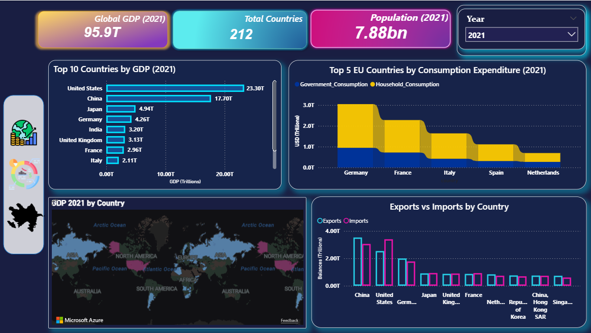
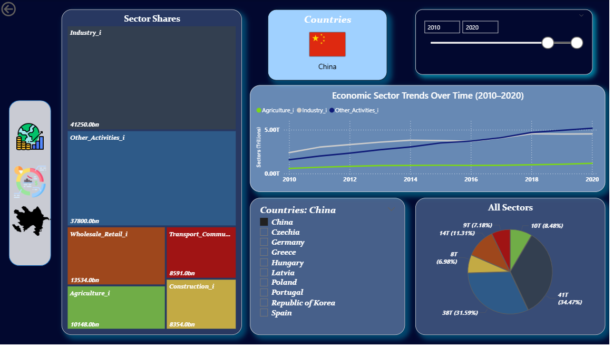
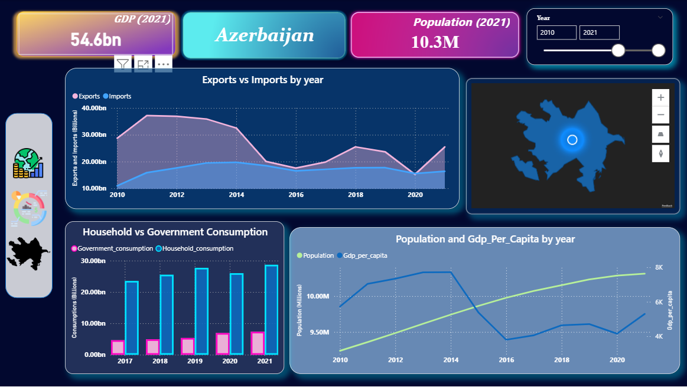

# Global Economic Indicators Analysis

## Project Overview
This project presents a complete end-to-end economic data analysis pipeline using Python, Excel, and Power BI.

The objective was to analyze global macroeconomic indicators and identify statistically significant relationships between GDP, trade balance, consumption, and population metrics.

---

## Key Components

### Data Processing (Python - Google Colab)
- Column standardization and renaming
- Missing value imputation (median method)
- Feature engineering
- Log transformations
- Correlation analysis
- Boxplot, heatmap, and violin visualizations
- Hypothesis testing (Paired t-test & Pearson correlation)

---

## Statistical Hypothesis Testing

1. Household vs Government Consumption (Paired t-test)
2. GDP vs GNI (Pearson Correlation)
3. Population vs GDP per Capita (Pearson Correlation)

Statistical significance was evaluated using p-values and correlation coefficients.

---

## Power BI Dashboard

### Page 1 – Global Overview
- Global GDP (2021)
- Top 10 GDP countries
- Trade balance comparison
- EU consumption analysis
- Global map visualization

---

### Page 2 – Sector Analysis
- Sector share breakdown
- Time-series sector trends
- Country-level sector distribution

---

### Page 3 – Country-Level Analysis
- Exports vs Imports
- Household vs Government consumption
- Population vs GDP per capita trends

---

## Excel Pivot Analysis

Three structured pivot analyses were created:

- Trade balance comparison
- GDP vs GNI comparison
- Population vs GDP analysis

---

## Tools & Technologies
- Python (NumPy, Pandas, Matplotlib, Seaborn, SciPy)
- Google Colab
- Microsoft Excel
- Power BI

---

## Repository Structure
